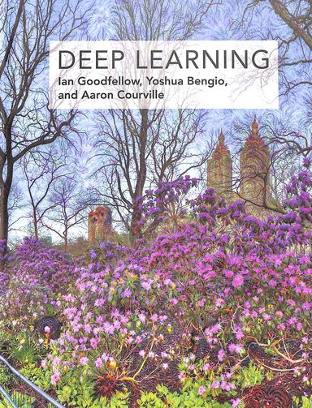

# Book: Artificial Intelligence A Mordern Approach - Fourth Edition

Code Practice from the Book AI Modern Approach ([AIMA](http://aima.cs.berkeley.edu/))

## Progress: 0% (0/28)

Chapter 1: Introduction

- [ ] Algorithms
    - [ ] C++
    - [ ] Python / Mojo
    - [ ] Lisp 
- [ ] Notes
- [ ] Exercices

Chapter 2: Intelligent Agents

- [ ] Algorithms
    - [ ] C++
    - [ ] Python / Mojo
    - [ ] Lisp- [ ] Notes
- [ ] Exercices

Chapter 3: Solving Problems by Searching

- [ ] Algorithms
    - [ ] C++
    - [ ] Python / Mojo
    - [ ] Lisp- [ ] Notes
- [ ] Exercices

Chapter 4: Search in Complex Enviroments

- [ ] Algorithms
    - [ ] C++
    - [ ] Python / Mojo
    - [ ] Lisp
- [ ] Notes
- [ ] Exercices

Chapter 5: Adversarial Search and Games

- [ ] Algorithms
    - [ ] C++
    - [ ] Python / Mojo
    - [ ] Lisp
- [ ] Notes
- [ ] Exercices

Chapter 6: Constraint Satisfaction Problems

- [ ] Algorithms
    - [ ] C++
    - [ ] Python / Mojo
    - [ ] Lisp
- [ ] Notes
- [ ] Exercices

Chapter 7: Logical Agents

- [ ] Algorithms
    - [ ] C++
    - [ ] Python / Mojo
    - [ ] Lisp
- [ ] Notes
- [ ] Exercices

Chapter 8: First-Order Logic

- [ ] Algorithms
    - [ ] C++
    - [ ] Python / Mojo
    - [ ] Lisp    
- [ ] Notes
- [ ] Exercices

Chapter 9: Inference in First-Order Logic

- [ ] Algorithms
    - [ ] C++
    - [ ] Python / Mojo
    - [ ] Lisp
- [ ] Notes
- [ ] Exercices

Chapter 10: Knowledge Representation

- [ ] Algorithms
    - [ ] C++
    - [ ] Python / Mojo
    - [ ] Lisp
- [ ] Notes
- [ ] Exercices

Chapter 11: Automated Planning

- [ ] Algorithms
    - [ ] C++
    - [ ] Python / Mojo
    - [ ] Lisp
- [ ] Notes
- [ ] Exercices

Chapter 12: Quantifying Uncertainty

- [ ] Algorithms
    - [ ] C++
    - [ ] Python / Mojo
    - [ ] Lisp
- [ ] Notes
- [ ] Exercices

Chapter 13: Probabilistic Reasoning

- [ ] Algorithms
    - [ ] C++
    - [ ] Python / Mojo
    - [ ] Lisp
- [ ] Notes
- [ ] Exercices

Chapter 14: Probabilistic Reasoning over Time

- [ ] Algorithms
    - [ ] C++
    - [ ] Python / Mojo
    - [ ] Lisp
- [ ] Notes
- [ ] Exercices

Chapter 15: Probabilistic Programming

- [ ] Algorithms
    - [ ] C++
    - [ ] Python / Mojo
    - [ ] Lisp
- [ ] Notes
- [ ] Exercices

Chapter 16: Making Simple Decisions

- [ ] Algorithms
    - [ ] C++
    - [ ] Python / Mojo
    - [ ] Lisp
- [ ] Notes
- [ ] Exercices

Chapter 17: Making Complex Decisions

- [ ] Algorithms
    - [ ] C++
    - [ ] Python / Mojo
    - [ ] Lisp
- [ ] Notes
- [ ] Exercices

Chapter 18: Multiagent Decision Making

- [ ] Algorithms
    - [ ] C++
    - [ ] Python / Mojo
    - [ ] Lisp
- [ ] Notes
- [ ] Exercices

Chapter 19: Learning from Examples

- [ ] Algorithms
    - [ ] C++
    - [ ] Python / Mojo
    - [ ] Lisp
- [ ] Notes
- [ ] Exercices

Chapter 20: Learning Probabilistic Models

- [ ] Algorithms
    - [ ] C++
    - [ ] Python / Mojo
    - [ ] Lisp
- [ ] Notes
- [ ] Exercices

Chapter 21: Deep Learning

- [ ] Algorithms
    - [ ] C++
    - [ ] Python / Mojo
    - [ ] Lisp
- [ ] Notes
- [ ] Exercices

Chapter 22: Reinforcement Learning

- [ ] Algorithms
    - [ ] C++
    - [ ] Python / Mojo
    - [ ] Lisp
- [ ] Notes
- [ ] Exercices

Chapter 23: Natural Language Processing

- [ ] Algorithms
    - [ ] C++
    - [ ] Python / Mojo
    - [ ] Lisp
- [ ] Notes
- [ ] Exercices

Chapter 24: Deep Learning for Natural Language Processing

- [ ] Algorithms
    - [ ] C++
    - [ ] Python / Mojo
    - [ ] Lisp
- [ ] Notes
- [ ] Exercices

Chapter 25: Computer Vision

- [ ] Algorithms
    - [ ] C++
    - [ ] Python / Mojo
    - [ ] Lisp
- [ ] Notes
- [ ] Exercices

Chapter 26: Robotics

- [ ] Algorithms
    - [ ] C++
    - [ ] Python / Mojo
    - [ ] Lisp
- [ ] Notes
- [ ] Exercices

Chapter 27: Philosophy, Ethics, and Safety of AI

- [ ] Algorithms
    - [ ] C++
    - [ ] Python / Mojo
    - [ ] Lisp
- [ ] Notes
- [ ] Exercices

Chapter 28: The Future of AI

- [ ] Algorithms
    - [ ] C++
    - [ ] Python / Mojo
    - [ ] Lisp
- [ ] Notes
- [ ] Exercices

- [ ] Appendix A
- [ ] Appendix B
- [ ] Exams 

[⬆ Back to the top](#Book:-Artificial-Intelligence-A-Mordern-Approach---Fourth-Edition) 

